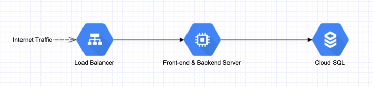
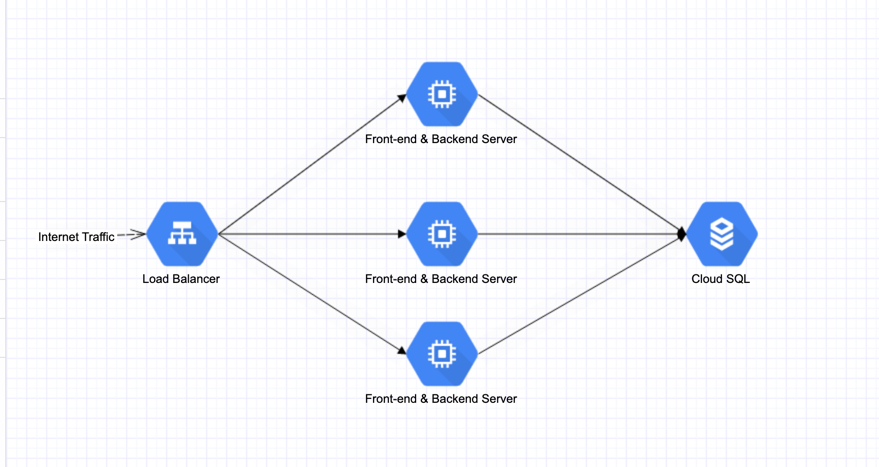
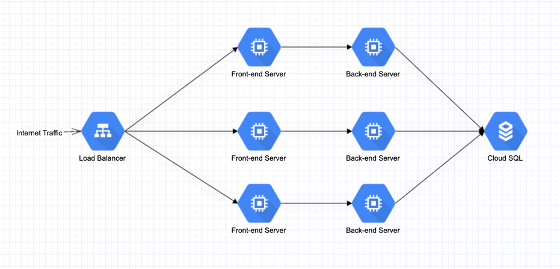
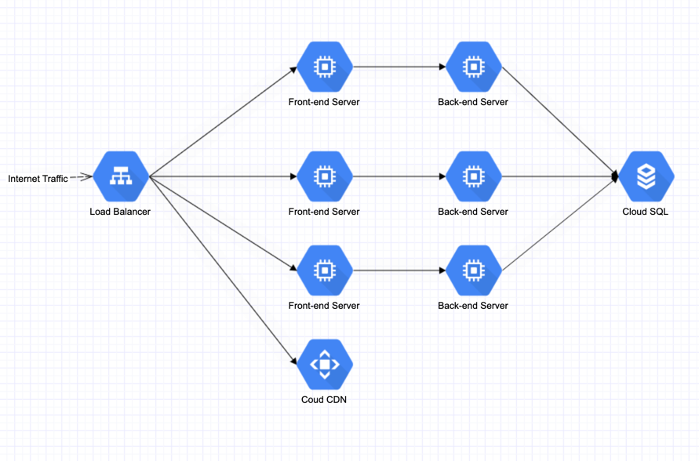
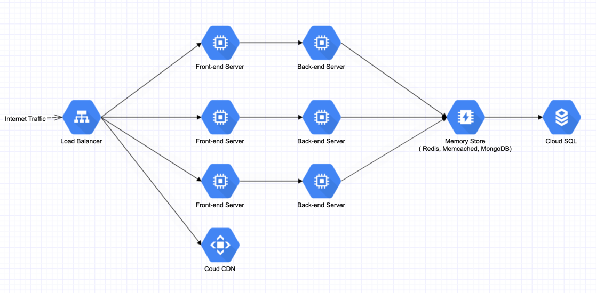
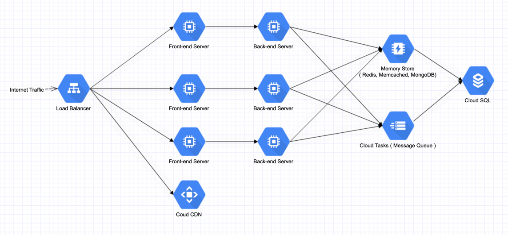
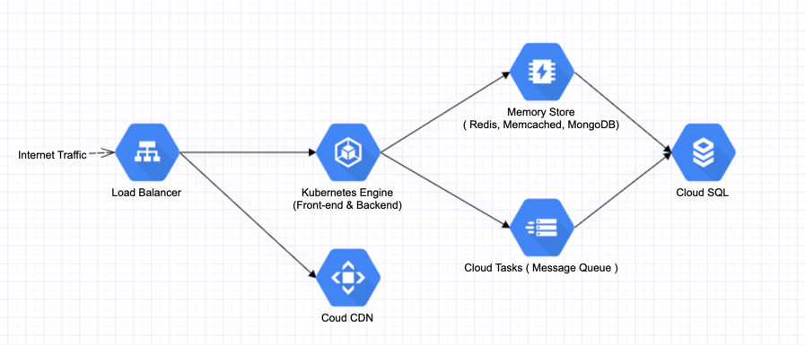
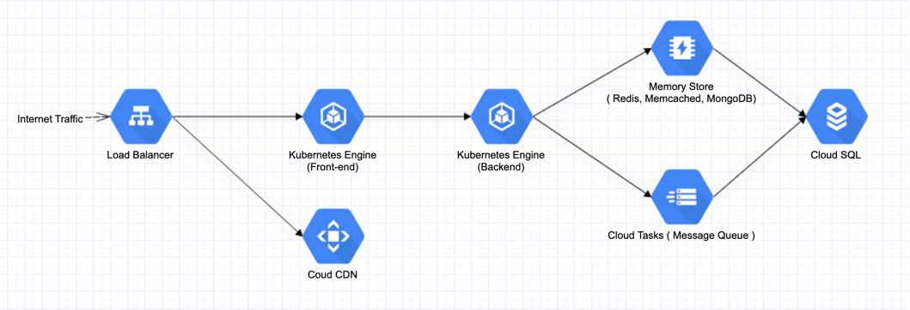
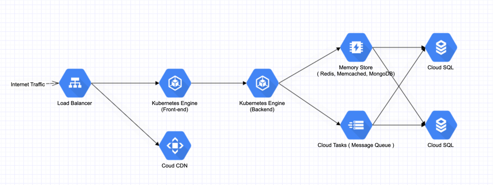

# System Design

## How to keep optimizing an internet-base system ?

For answering this question, I would like to decompose this problem by granularity. The ultimate goal of enhancing a
system is usually to increase speed, capacity and sustainability. With these ideas in mind, I will start with a solution
from very basic and simple all the way to a complex design that I can imagine.

### Solution #1

> Internet Traffic goes straight to our Cloud Provider Load Balancer, and it routes traffic
> to single front-end and back-end server. And this server connects to a single cloud SQL database

For this design, it is the most basic one for a low-cost and viable web service. It satisfies a fundamental
functionalities. A service with front-end UI interface, backend service for business logic handling and SQL database for
data persistence storage.

We have the following methods to increase speed

1. If Database IO is our bottleneck, which usually is. We can start using SQL (indexing) feature for faster fetching.
2. If is a business logic and compute intensive logic. we can increase our performance of CPU and RAM.
3. If it is a networking issue. We can change our deployment to a region that is closer to end user.

### Solution #2

> Internet Traffic still goes to our Cloud Provider Load Balancer, and it routes traffic
> to multiple servers. Each server handles user requests separately. And all these servers
> connect to single cloud SQL database

This design increases handling capability horizontally. Since, most times servers handle user requests as independent
tasks. We can simply add more servers to handle more traffic. With load balancer in place, it can intelligently
distribute traffic to servers without overloading one or small parts of servers, taking full advantage of the overall
computation resources.

### Solution #3

> We separate font-end servers and backend servers. Let front-end servers focus only on user
> experience and back-end servers to handle only business compute logic.

Previous design both front-end and back-end are sharing the same server. We now disperse pressure with different
servers. It really depends on our business model. If our business model are back-end compute intensive, like math
computation, complicated back-end fetching, intensive asynchronized tasks and etc. We let back-end focus on its own
computation and let front-end to deliver good user experience.

### Solution #4

> Now, we add a Cloud CDN server to help caching front-end resource for user with faster and better response.

Speed is vague description for system design. It can be slow UI loading, Slow back-end responding. With this design, we
are trying to improve faster UI loading. Sometimes, UI might contain massive amount of images and certain front-end
libraries. With Cloud CDN in place, it can deliver these "static" resources closer to user region with faster loading.
User will experience a fast response of UI content.

### Solution #5

> We now introduce a Memory Cache component to act as LRU cache. We can choose products like Redis,
> Memcached or MongoDB. This really depends on company engineering decision.

Back to enhancement for backend, this time our database IO might be our bottleneck. Sometimes, user might be frequently
fetching data that have been visited before. This behavior will overload our database IO capacity. With memory cache,
back-end servers can firstly try fetching data from memory cache, if it got the data, we save the SQL fetch behavior. If
it fails at memory cache, it can then go to Cloud SQL, at the same time, we store that data at memory cache to boost
next time fetch. Obviously, memory cache is not unlimited and free. We might need to design our own maximum capacity and
garbage collection mechanism.

### Solution #6

> We now introduce a Cloud Tasks (Message Queue) component to handle data write behavior.

Still database IO is our bottleneck. Previously, we focus more on the data "Read" behavior. We now introduce a way to
increase "Write" behavior. This time, instead of performing our write behavior directly to DB, we send write task to
message queue. We let the message queue to control the speed and frequency of inserting data to DB. It will increase the
speed of back-end response and treats data upload as asynchronized tasks.

### Solution #7

> Instead of using individual servers, this time we introduce Kubernetes to package our front-end and back-end
> service together.

With previous design, if traffic suddenly goes skyrocketed, we might need to manually increase servers for both
front-end and back-end services. We might not have the man power to handle it out of sudden. In addition, if traffic
plummets after a short period of time, the increased compute resources will keep generating high cost and low values.
Using technology like Kubernetes, it can intelligently expand compute resources (servers) horizontally by traffic. And
the deployment of service to Kubernetes is simple and easy. It can simplify our build and deployment pipeline as well.

### Solution #8

> This time, we can separate our front-end and back-end components with separate Kubernetes Clusters.

This design might not be necessary but still has its benefits. It really depends on company business model. If our
business is both front-end and backend computation intensive. This design might help with our performance.

### Solution #9

> Finally, we offer more SQL database to enhance capacity of permanently storage.

For this design, it is viable with slight enhancement, however NOT recommended. Because, data consistency is critical to
any system. We never want to deal with messy database with data that conflicting to each other. This design, might
include extra work like data sharding, separate storage and etc. It brings huge risk for back-end service handling and
increases storage complexity.

### Extra

Here. we have discussed mostly on regular business logic handling, data reading and writing. For configuration file,
images, audio, video, machine learning file, search indexing, GPU parallel computation and more have not been covered on
this document. Each area has it own unique design and skills to implement. If you feel interested, we can open another
topic to discuss.

Thanks for your review! By Changyou Yu at 2021.08.15
